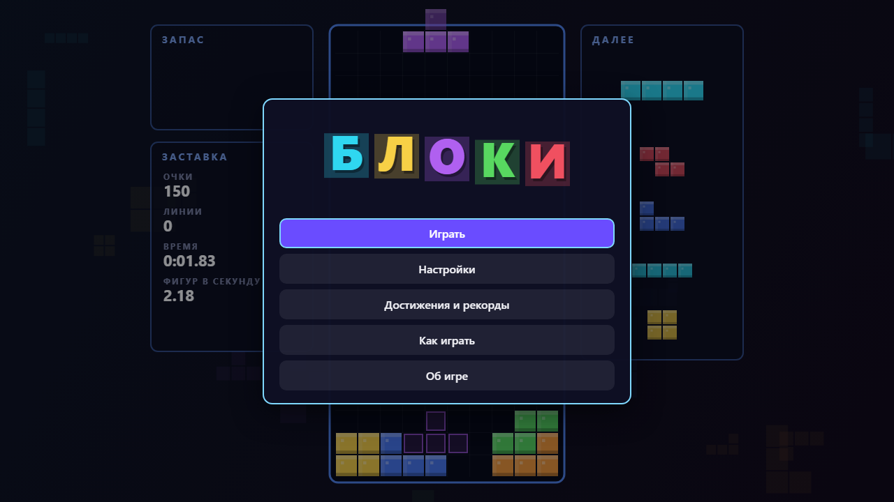
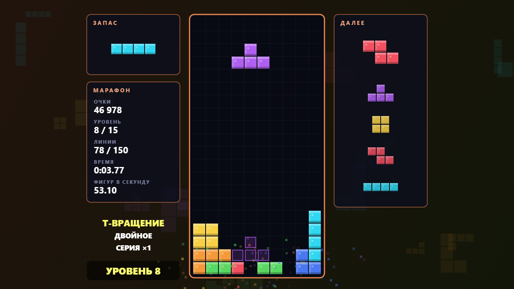
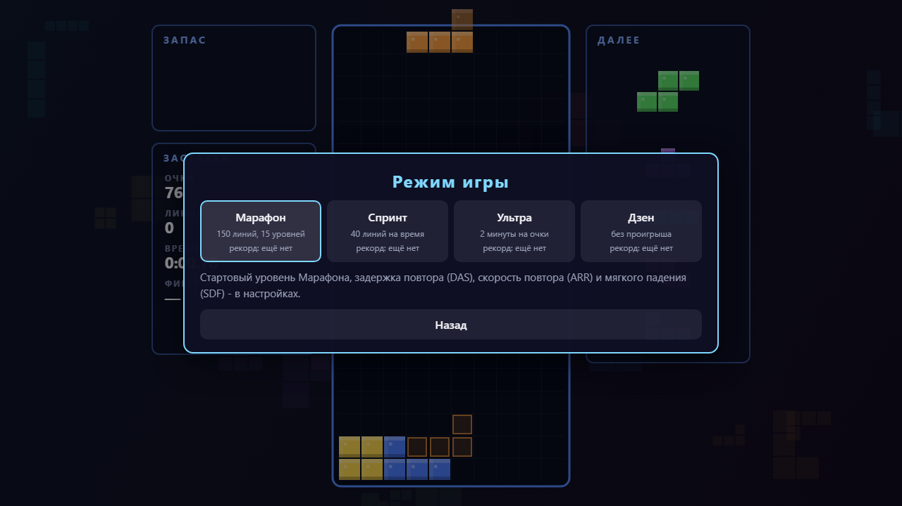

# FallingBlocks - Блоки

[English](README.md) · **Русский**

**Блоки** - головоломка с падающими фигурами на одной HTML-странице: собирай ряды, держи фигуру в запасе, крути фигуры в тесные щели. Работает в браузере без сервера и без интернета: откройте `index.html` или играйте онлайн.

**[▶ Играть онлайн](https://alexalesha.github.io/FallingBlocks/)**

> Фанатская игра, не связана с правообладателями похожих игр. Правила вращения - по открытому описанию системы SRS, очередь - «мешок» из семи фигур.







## Что есть в игре

- **Режимы:** Марафон (150 линий и 15 уровней, каждые 10 линий быстрее), Спринт (40 линий на время), Ультра (очки за 2 минуты), Дзен (без проигрыша).
- Очки: 100 / 300 / 500 / 800 за одну-четыре линии, умноженные на уровень, T-вращения 400-1600, серия сложных очисток ×1,5, комбо и бонус за чистое поле.
- Призрак фигуры, ожидание на земле до 15 сдвигов, запас раз за ход; DAS, ARR и скорость мягкого падения - в настройках.
- Достижения и рекорды по режимам, переназначение клавиш, геймпад; рисунки, музыка и звуки сделаны в коде.

## Управление

| Клавиша | Действие |
|---|---|
| ← → | сдвиг |
| ↓ | мягкое падение |
| Пробел | жёсткий сброс |
| ↑ или X / Z | поворот по часовой / против |
| C или Shift | в запас |
| Esc или P | пауза |

Где игра это позволяет, клавиши меняются в настройках.

## Запуск у себя

Откройте `index.html` в Chrome, Edge или Firefox. Всё лежит в репозитории, ничего не скачивается.

## Проверки

Законы - проверки Playwright в `tests/`. Они открывают страницу по файловому адресу в безголовом
Chromium, по одной за раз:

```
npm install
npx playwright install chromium
npm test
```

Захват мыши в проверках всегда поддельный: настоящий `requestPointerLock` в безголовом Chromium
на Windows может зажать курсор пользователя.
Кадры выше сняты в безголовом браузере скриптом кадров сборника GameRoom.

## История

Игра сделана в сборнике [GameRoom](https://github.com/ALEXalesha/GameRoom), там она же работает в Игротеке ([играть там](https://alexalesha.github.io/GameRoom/)). Здесь игра лежит вместе с историей коммитов.

## Лицензия

MIT, см. [LICENSE](LICENSE).
